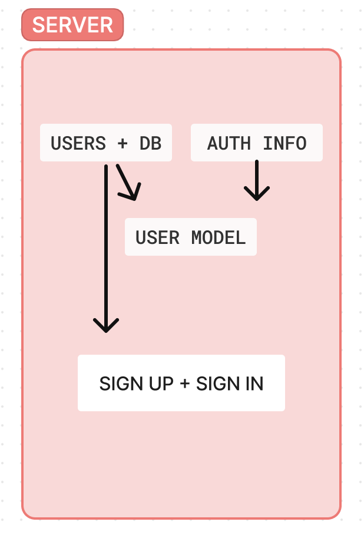

# basic auth

**Author**: Wajiha Khan

**Version**: 1.0.0

**Overview**:

The codebase provides a basic authentication system using Node.js and Express, with user data stored in a PostgreSQL database. It ensures secure password storage using bcrypt hashing and implements user authentication based on basic authentication headers. This setup allows users to sign up, sign in, and access protected routes within the application.

